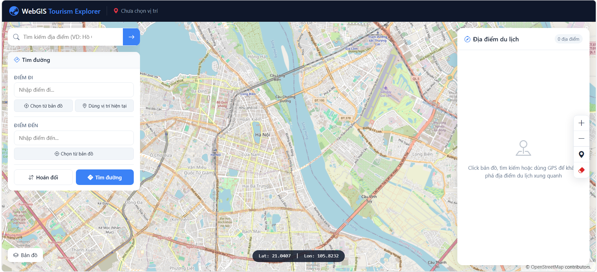
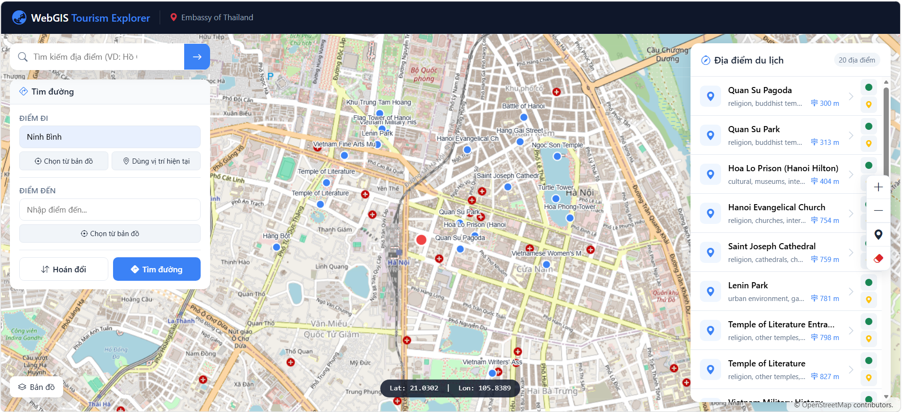
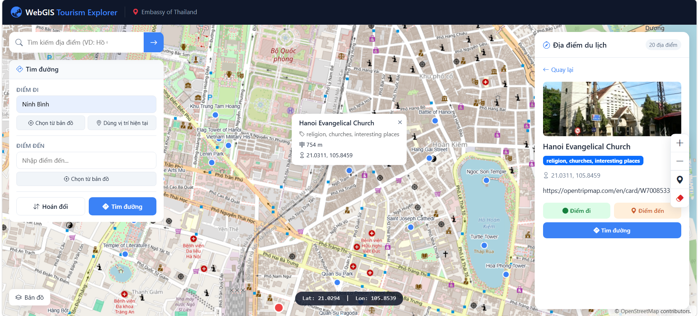
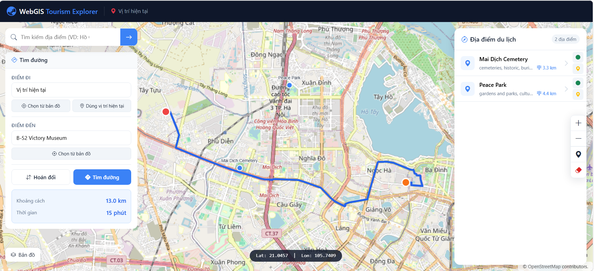
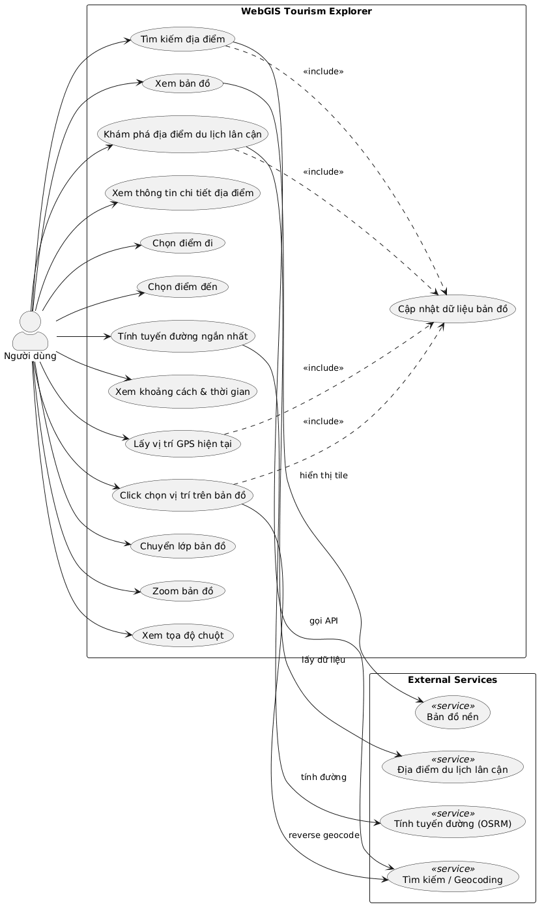
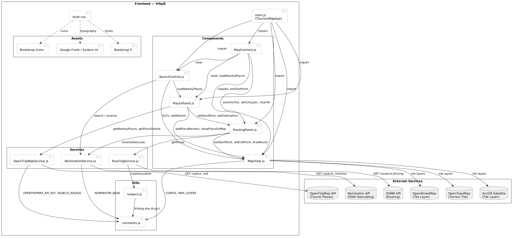
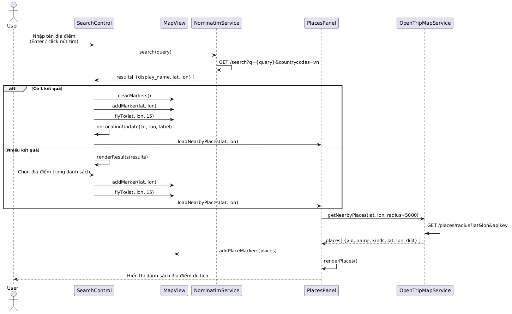
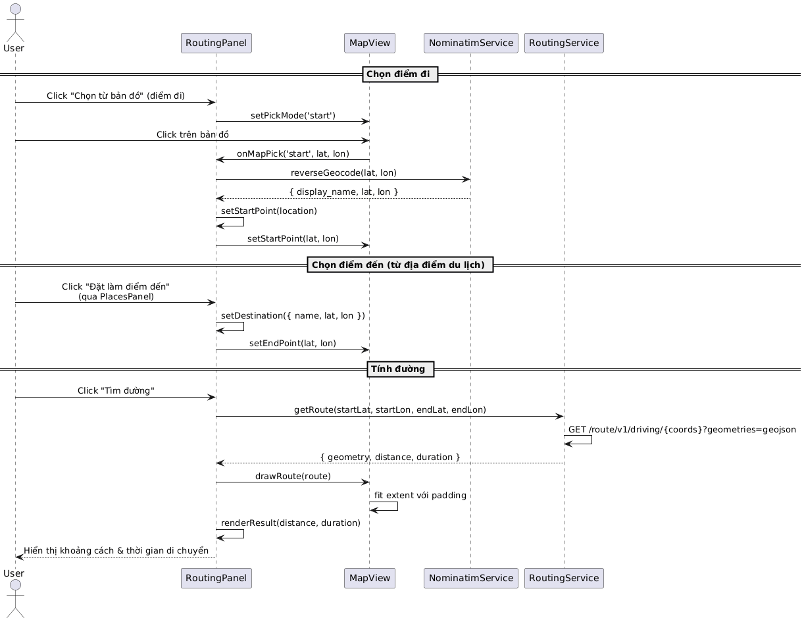
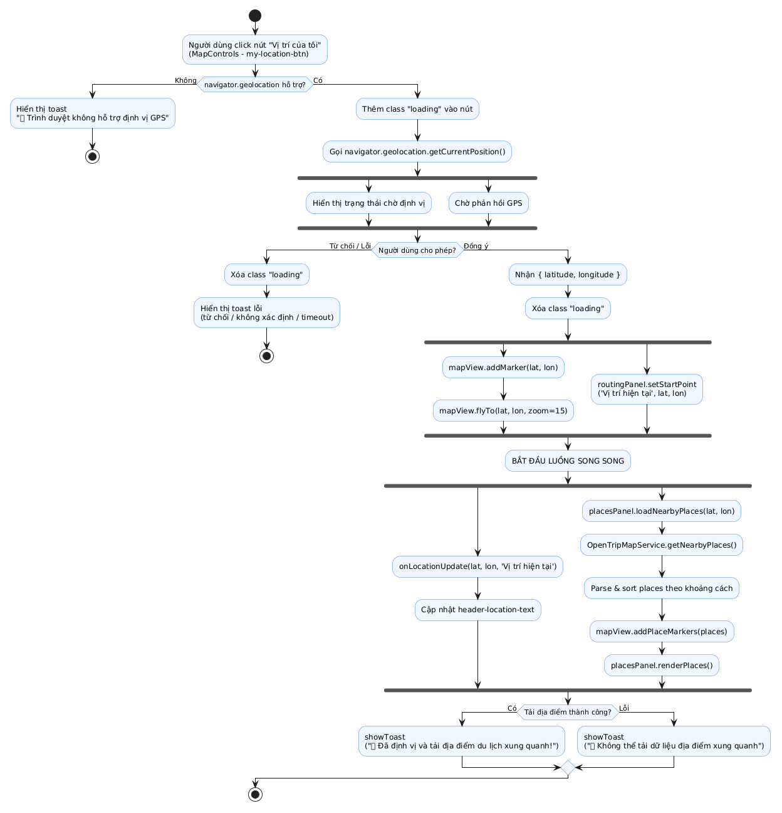

# WebGIS Tourism Explorer

Ứng dụng bản đồ du lịch trực tuyến cho phép khám phá địa điểm, tìm đường đi và xem thông tin du lịch theo thời gian thực.

---

## Giao diện
-- Giao diện trang chủ 


-- GoiYDiaDiemDuLich


-- Thông tin địa điểm chi tiết


-- Tìm đường
 

---

## Tính năng chính

-  **Tìm kiếm địa điểm** theo tên, hỗ trợ gợi ý kết quả
-  **Định vị GPS** lấy vị trí hiện tại của người dùng
-  **Khám phá địa điểm du lịch** lân cận trong bán kính 5km
-  **Xem thông tin chi tiết** địa điểm (mô tả, hình ảnh, tọa độ)
-  **Tính tuyến đường ngắn nhất** giữa hai điểm bất kỳ
-  **Hiển thị khoảng cách và thời gian** di chuyển
-  **Chuyển đổi lớp bản đồ**: Đường phố / Vệ tinh / Địa hình
-  **Xem tọa độ chuột** theo thời gian thực

---

## Công nghệ sử dụng

| Thành phần | Công nghệ |
|---|---|
| Framework | JavaScript ES6 Modules + Vite |
| Bản đồ | OpenLayers 10 |
| UI | Bootstrap 5 + Bootstrap Icons |
| Geocoding | Nominatim API (OpenStreetMap) |
| Địa điểm du lịch | OpenTripMap API |
| Tính đường | OSRM (Project OSRM) |
| Tile bản đồ | OpenStreetMap / OpenTopoMap / ArcGIS |

---

## Kiến trúc dự án

```
src/
├── components/
│   ├── MapView.js          # Quản lý bản đồ OpenLayers
│   ├── SearchControl.js    # Thanh tìm kiếm địa điểm
│   ├── PlacesPanel.js      # Danh sách địa điểm du lịch
│   ├── RoutingPanel.js     # Tìm đường & hiển thị kết quả
│   └── MapControls.js      # GPS, zoom, chuyển layer
├── services/
│   ├── NominatimService.js      # API tìm kiếm & geocoding
│   ├── OpenTripMapService.js    # API địa điểm du lịch
│   └── RoutingService.js        # API tính tuyến đường
├── utils/
│   ├── constants.js        # Cấu hình & hằng số
│   └── helpers.js          # Hàm tiện ích
└── styles/
    └── style.css           # Giao diện toàn ứng dụng
```

---

## Biểu đồ thiết kế

### Use Case Diagram


### Component Diagram


### Sequence Diagram — Tìm kiếm địa điểm


### Sequence Diagram — Tính tuyến đường


### Activity Diagram — Định vị GPS


---

## Cài đặt & Chạy

```bash
# Clone repository
git clone <repo-url>
cd timkiemdiadiemdulich

# Cài đặt dependencies
npm install

# Chạy môi trường phát triển
npm run dev

# Build production
npm run build
```

> Mở trình duyệt tại `http://localhost:5173`

---

## Cấu hình API Key

Chỉnh sửa file `src/utils/constants.js`:

```js
export const CONFIG = {
  OPENTRIPMAP_API_KEY: 'your_api_key_here',
  DEFAULT_CENTER: [105.8412, 21.0285], // Hà Nội
  DEFAULT_ZOOM: 14,
  SEARCH_RADIUS: 5000  // mét
}
```

> Đăng ký API key miễn phí tại: https://opentripmap.io

---

## Yêu cầu hệ thống

- Node.js >= 20.19.0
- Trình duyệt hiện đại hỗ trợ ES6 Modules & Geolocation API

---

## Giấy phép

MIT License